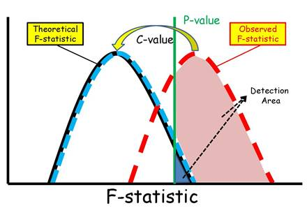

.. _afd:

=========
Detection
=========
InfraPy uses an Adaptive Fisher-Detector (AFD) for identifying detections in the beamforming results.  The standard F-detector is based on decision rules for the F-statistic, which provides an estimate of the signal's beam power and is calculated as the power in the beam divided by the average over all channels of the power difference between the beam and the individual channels \cite{Blandford:1982}.  The AFD accounts for both correlated and uncorrelated noise through an increase in the value of the F-statistic required to declare a detection based upon background F-values being elevated from coherent or persistent noise sources. The figure below illustrates how the AFD remaps the F-statistic through the application of a C-value, which effective reduces the detection threshold (p-value) and decreases the number of noise-related detections.

See the following for more references on the Adaptive F-Detector:
    - `Arrowmsith et al., 2008 <https://doi.org/10.1111/j.1365-246X.2008.03912.x>`_
    - `Arrowsmith et al., 2009 <https://pubs.geoscienceworld.org/ssa/bssa/article/99/1/449/342096>`_
