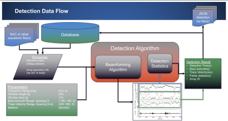
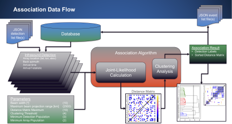
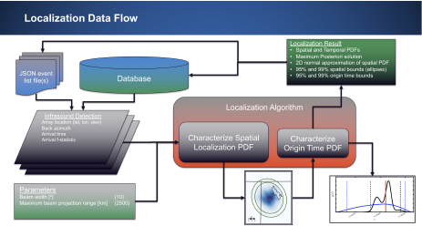

.. _dataprocess:

=====================================
Data Processing Flow
=====================================

Data can be processed using InfraPy in a variety of ways.  See the images below for examples of data processing workflows.

_____________________________________
:ref:`afd`
_____________________________________

_____________________________________
:ref:`association`
_____________________________________

_____________________________________
:ref:`localization`
_____________________________________

.. toctree::
    :maxdepth: 5
    :titlesonly:

    standalone
    pipeline
